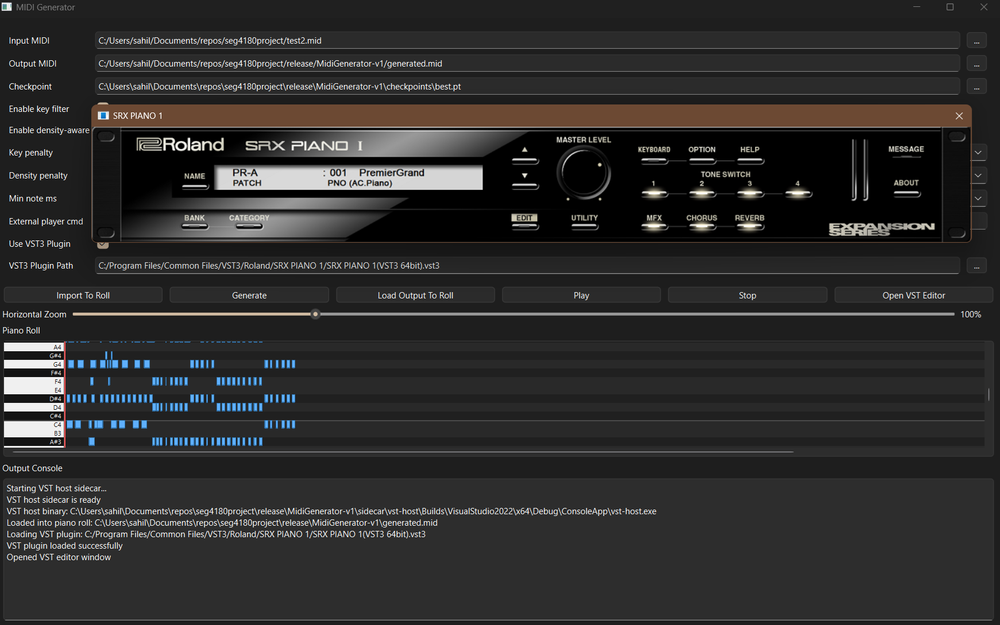

# MIDI Transformer Music Generator

## Overview

This project is a symbolic music generation tool based on a decoder-only Transformer (GPT-style) model. Given a short MIDI prompt, the model generates a musically coherent continuation, outputting a new MIDI file. The system features a PySide6 Qt desktop app for user interaction and a JUCE-based VST host sidecar for realistic plugin playback.

## Features

- Generate MIDI continuations from user-provided prompts
- Transformer-based model trained on Lakh and MAESTRO datasets
- Key filtering and density-aware controls for more musical outputs
- Standalone desktop app with piano roll visualization
- VST plugin support for high-quality playback

## Installation

1. Download all release parts (`.zip.001`, `.zip.002`, etc.) from the [Releases](https://github.com/ssHUKLaa/seg4180project/releases) page.
2. Use [7-Zip](https://www.7-zip.org/) or a compatible tool to extract the archive:
   - Right-click the `.zip.001` file and select “Extract here.”
3. Run the extracted application (no separate Python install required).

## Usage

1. Launch the desktop app.
2. Load a MIDI file as a prompt.
3. Adjust generation parameters (key filter, density, etc.) as desired.
4. Click “Generate” to create a continuation.
5. Play back the result using the built-in VST host.

## Requirements

- Windows 10/11 (64-bit)
- No separate Python installation needed (packaged build)
- For source builds: Python 3.10+, PyTorch, PySide6, JUCE

